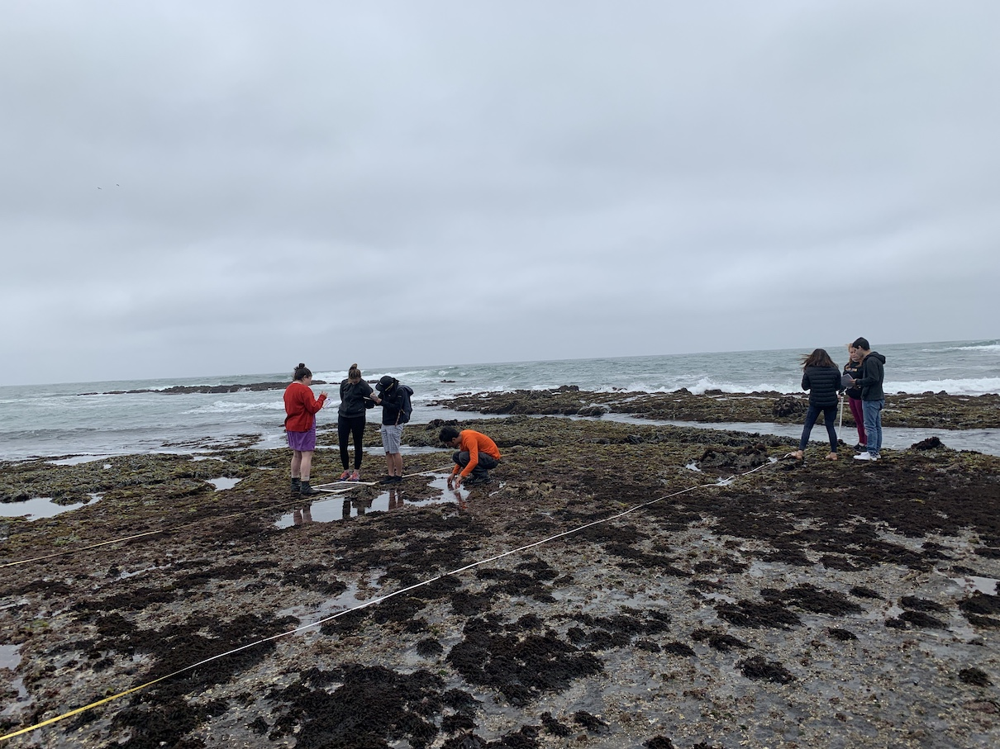

```{r setup, include=FALSE}
knitr::opts_chunk$set(echo = FALSE, message = FALSE, error = FALSE)
```

# Introduction

Tide pools are considered to be the area where land and water interact. They occupy a thin strip of land that is constantly exposed to high and low tides. Because of these unique conditions, tide pools are incredibly robust and are beaming with all kinds of life. Many of the species located by tide pools have adapted to be able to live in and out of water. Tide pools can be found along the entire Pacific Coast of the United States, including California. Throughout Northern California, they occupy long shorelines while in Southern California they tend to be more spotty and patchy. 

California's intertidal zone formed from shifts in our tectonic plates that took place over millions of years. The foundational rock formations for the intertidal zone began shifting into place as early as 150 million years ago. Because of the proximity to sediments for so long, intertidal zones have always been one of the prime areas to be affected by erosion. 

As noted, the intertidal zone is incredibly geographically diverse. It is home to species such as *Lottia spp.* (limpet), *Haliotis cracherodii* (black abalone), and *Pisaster ochraceous* (Ochre sea star), a powerful keystone species and major indicator of intertidal zone health. Plants that can be found in the intertidal zone include *Sylvetia compressa* (rockweed), *Egregia menziesii* (feather-boa kelp), and *Corallina spp.* (coralline algae). These species continuously interact with one another to deliver nutrients and facilitate metabolism and reproduction.

Species living throughout the intertidal zone are affected by many environmental factors such as air temperature, water temperature, and wave exposure in coordinance with the moon's phases. Hotter temperatures increase the metabolic rate for most species, although temperatures that are too hot make immersion in water unbearable. In these situations, species have to decide to forego comfort in order to move to a more livable location. It can be very challenging to live under water half of the time, and so many species such as the *Anthopleura elegantissima* (aggregating anemone) are able to minimize their presence to avoid major harm. This being said, immersion in water also yields many benefits. The flow of water across the intertidal zone helps regulate body temperature and delivers key nutrients to species through a process called coastal upwelling. Wave exposure depends largely on the gravitational pull from the moon. Wave amplitude is typically 1-3 meters and is greatest during a full moon. Amplitude is at its least during the 1st and 3rd quarter moon phases. 

Aside from the natural stressors of erosion and immersion, intertidal species are unfortunately subject to many other natural and human-caused stressors. Pollution is a huge issue, often it comes from storm runoff (which is very difficult to clean), oil spills, and sewage. Climate change is a byproduct of this which directly affects how many intertidal species live. Climate change also causes ocean acidification which also harms organisms. Human-caused issues can be seen through exploitation of various species such as *Tegula funebralis* (snail) for souvenirs and cuisine. Humans also harm such species when they visit intertidal zones through physical encroaching and stepping on them. These human practices are effectively serving to deplete a lot of intertidal life. This has helped environmentalists advocate for legislation such as the Marine Life Protection Act of 1999 to be passed. Additionally, many communities throughout California have formed groups dedicated to monitoring, protecting, and researching the intertidal zone. 

# Methods

## Study Site

Our analysis was conducted at the Pillar Point tide pools in the Princeton neighborhood of Half Moon Bay, California. The area is situated along a harbor frequented by tourists and locals alike and is in close proximity to the Half Moon Bay Yacht Club. Nearby is Mavericks Beach, a destination popular amongst surfers for its high tides, and the Fitzgerald Marine Reserve, a nearby environment also encompassing tide pools and other aquatic life. In order to get to Pillar Point, we had to hike along a hill and trek through fields of ice plants. Pillar Point is a great location for exploring tide pools because its low tide leaves a lot of land uncovered. 

We first attended the site on Tuesday, May 28th, 2019 at around 11:30 a.m. This time period features a high temperature of 64 degrees Fahrenheit and a low temperature of 61 degrees Fahrenheit. The climate displayed scattered clouds and westward winds at 17 miles per hour. On this day, we simply took time to familiarize ourselves with the area and did not do any analysis. We arrived close to low tide. 

We returned to the site on Wednesday, May 29th at 11:00 a.m., slightly earlier than the day before. The temperature featured a high of 66 degrees Fahrenheit and a low of 57 degrees Fahrenheit, three times the range of the prior day. The weather was significantly cloudy and winds blew westward at a speed of 21 miles per hour. We waited around 30 minutes for the tide to get low enough to explore the tide pool. We did not begin our exploration during the trough, but rather as the tide approached its lowest point. 

When we attended the intertidal area, we were largely secluded from other people. A total of 5 other people were present during the entire time we were there across both days. None of these people entered the tide pool and simply walked along the beach. 

## Field Methods

To collect our data, we used a tape measure to define our transect of about 40 meters. The transect was located towards the rightmost edge of the tide pool while other groups defined transects in other directions. We used a base plate compass to obtain a bearing of 270 degrees, along which we laid our measuring tape. 

Using a 2 ft. by 2 ft. grid constructed from plastic pipes, we placed the lower leftmost edge at every 5 meter mark on our transect. The grid contained 25 equally sized squares. Within the encompassed quadrat zone, we counted all the mobile species such as snails and urchins. For non-mobile species such as plants, we counted the number of squares they appeared in and multiplied this value by 4 (the percent value per square -- 100%/25 squares) in order to obtain an approximation of their presence. In quadrats that contained water, we recorded the temperature in degrees Celsius using a thermometer as well as the depth at the lowest point in centimeters using a standard ruler. All of our observations were recorded by quadrat in field notebooks that would later be used to input data into spreadsheets for analysis. 




**Figure 1:** Intertidal transect-based quadrat sampling method.

## Analysis Methods

Before entering data into a spreadsheet, the entire class engaged in name standardization. Each group listed names they used to describe species they saw (eg. "tiny snail"). Afterwards, each group entered the scientific name for each species so that they had a guide to refer to when conducting analysis. The purpose of name standardization is to encapsulate all relevant data for analysis in the simplest and most concise way. 

On our official spreadsheet, only one name was used among all three groups per species. Within our spreadsheet, there was a column to record group number, a column to record distance from the shore in meters, a column for the type of measurement made (temperature Celsius, depth in centimeters, area in percent, count in integers), a column noting what species was observed, a column with a specific measurement corresponding to the type of measurement made, a column for measurement units, and a column for miscellaneous notes, 

Prof. Zimmerman conducted further processing and examination to correct spelling, correct capitalization, remove whitespace and ensure that all groups of data were displayed consistently. Afterwards, he exported the dataset as a .CSV file into a new R Project in R Studio. At this point, the data was ready for analysis.


# Results


```{r load-packages-and-data}

library("tidyverse")
intertidal_data <- read.csv("data/2019-05-30_pillar_point_intertidal_data.csv")

```


## Overall Results

#### My primary goal for the aggregated data was to explore variation across group results, specifically as it pertained to species richness and types of species encountered. 


```{r 1.1}

intertidal_data %>%
  filter(!(species_or_type %in% c("bare rock", "water", "sand"))) %>%
  group_by(group_number, distance_from_shore_in_m) %>%
  tally() %>%
  ggplot(aes(x = factor(group_number), y = n, fill = factor(group_number))) + geom_boxplot() + ggtitle("Richness by Group") + theme(plot.title = element_text(hjust = 0.5)) + xlab("Group Number") + ylab('Richness per Quadrat')

```

**Figure 1**

Our analysis begins with a boxplot of richness (the total number of different species per quadrat) for each group. The graph shows that group one had the widest variance and largest median richness across all quadrats. Group one also had a maximum richness of 8, the largest total richness for any single quadrat in the dataset. Interestingly, this value was not an outlier for group one while lesser values were outliers for groups two and three. Groups two and three had very similar variances to each other, they tended to have richness values of 4-5 species for each quadrat. Group two had one large outlier and group three had one small outlier.


```{r 1.2}

intertidal_data %>%
  filter(measurement_units == "percent") %>%
  ggplot(aes(y = measurement, x = factor(group_number), fill = factor(group_number))) + geom_boxplot() + ggtitle("Group Variation", subtitle = "Area Species") + theme(
    plot.title = element_text(hjust = 0.5),
    plot.subtitle = element_text(hjust = 0.5)
) + xlab("Group Number") + ylab('Species Variation')


intertidal_data %>%
  filter(measurement_units == "individuals") %>%
  ggplot(aes(y = measurement, x = factor(group_number), fill = factor(group_number))) + geom_boxplot() + ggtitle("Group Variation", subtitle = "Individual Species") + theme(
    plot.title = element_text(hjust = 0.5),
    plot.subtitle = element_text(hjust = 0.5)
) + xlab("Group Number") + ylab('Species Variation')

```

*Area species comprise of immobile or uncountable species such as **Sylvetia compressa**(rockweed), **Ulva spp.**(sea lettuce), and other plants.*

*Individual species comprise of mobile or countable species such as **Tegula funebralis**(snail), **Lottia spp.**(limpet), and others.*

**Figures 2 & 3**

I was also interested in the variation among types of species. We observed species measured by count and species measured in terms of percentage of area covered. 

Among the area species, I observed that groups one and three have similarly high variation. Group two has less variation and experienced two outlier values. 

Among the individual species, I observed that variation among groups was confined to the same relative interquartile range. Group 1 had lower maximum values that groups 2 and 3 and also had two outliers. Group 2 had one outlier and group 3 had none. It seems as though the location of the boxes rose as the group number progressed. 


```{r 1.3}

intertidal_data %>%
  filter(!(species_or_type %in% c("bare rock", "water", "sand"))) %>%
  filter(temp_depth_area_or_count == "count") %>%
  group_by(species_or_type) %>%
  summarise(count = n()) %>%
  arrange(count) %>%
  mutate(species_or_type = factor(species_or_type, species_or_type)) %>%
  ggplot(aes(x = species_or_type, y = count, fill = count)) + geom_bar(stat = "identity") + ggtitle("Individual Species Frequency") + theme(plot.title = element_text(hjust = 0.5)) + xlab("Species") + ylab('Count') + scale_fill_continuous(high = "#132B43", low = "#56B1F7") + theme(axis.text.x = element_text(angle = 90))

```


**Figure 4**

My last graph caused me to think more about which specific countable species were making up the values in the boxplot. We see that *Tegula funebralis* (snail) and *Anthopleura elegantissima* (anemone) showed up the most across all quadrats. Aside from these two, no other species was observed in a majority of quadrats. The bar graph shows us considerable richness in that there are a plethora of species present, however there is a lack of evenness among their presence. 


## Group Results

#### Our group-specific plots aimed to observe trends associated with distance from the coast.


```{r 2.1}

intertidal_data %>%
  filter(group_number == 1) %>%
  filter(!(species_or_type %in% c("bare rock", "water", "sand"))) %>%
  group_by(group_number, distance_from_shore_in_m) %>%
  tally() %>%
  ggplot(aes(x = distance_from_shore_in_m,
             y = n)) +
  geom_col(fill = "darkred") + 
  ggtitle("Species Richness per Quadrat",
          subtitle = "Group 1") + theme(
    plot.title = element_text(hjust = 0.5),
    plot.subtitle = element_text(hjust = 0.5)
) +
  xlab("Distance from shore (m)") +
  ylab("Species Richness") 

```

**Figure 1**

Our first graph observes richness per quadrat as we move further along our transect. Our 3rd and 6th quadrats had the largest richness with values of 6 and 8 respectively. After the 4th quadrat, the richness never dipped below 5 species.


```{r 2.2}

intertidal_data %>%
  filter(group_number == 1) %>%
  filter(measurement_units == "percent") %>%
  ggplot(aes(x = measurement, y = distance_from_shore_in_m)) + geom_point(size = 5) + geom_abline() + ggtitle("Area Species vs. Distance", subtitle = "Group 1") + theme(
    plot.title = element_text(hjust = 0.5),
    plot.subtitle = element_text(hjust = 0.5)
) + xlab("% of Area Species per Quadrat") + ylab('Distance from Shore (m)')

```

**Figure 2**

I then began to wonder which types of species were increasing in presence and richness as we got further from the shore. Our scatter plot shows there to be a fairly strong association between area species presence and distance from the shore. Would this be the case for individual species?


```{r 2.3}

intertidal_data %>%
  filter(group_number == 1) %>%
  filter(measurement_units == "individuals") %>%
  ggplot(aes(x = measurement, y = distance_from_shore_in_m)) + geom_point(size = 5) + geom_abline() + ggtitle("Individual Species vs. Distance", subtitle = "Group 1") + theme(
    plot.title = element_text(hjust = 0.5),
    plot.subtitle = element_text(hjust = 0.5)
) + xlab("Count of Individual Species per Quadrat") + ylab('Distance from Shore (m)')

```

**Figure 3** 

We see a very similar trend to what we saw in the last scatter plot. There is a fairly strong association between individual species presence and distance from shore. It appears that this trend is irregardless of area or individual species.


# Discussion


Throughout my time studying the intertidal zone, I was exposed to different factors that made me think about what the optimal conditions would be for life to thrive. Specifically, I wanted to learn more about the role of water as well as shoreline location in determining richness and ecological health. My initial thought was that areas in the middle of the tide pool with direct exposure to water would be the most robust. What I eventually found out was that different types of species thrive in different locations and with differing exposure to water. This indicates to me that there is no single type of environment that suites everyone.

I was initially surprised to see that my group (group  1) had the largest maximum richness in the entire dataset as well as the largest variance. After giving it some thought, I attributed this to our transect location. Our transect was located along the rightmost edge of the tide pool. There were quadrats were it was exposed to large amounts of water and also quadrats where no water was present even outside of the quadrat. I feel that proximity to water has a great affect on richness because of the aforementioned benefits of water in regulating temperature and providing nutrients through coastal upwelling. This facilitates metabolic and reproductive strength and allows for life to blossom under the right conditions. Given this, I believe that the areas exposed to water more frequently in our transect, possibly during high tide, were primarily responsible for our high richness value. Group two's transect went down the middle of the tide pool and thus they did not find many quadrats with exposure to water. Similarly, group three's transect had a lot of water closer to the shore but not as much when they approached the tide pools. This results in a tradeoff between water exposure and comfort for species in group three's transect, which is likely one reason they observed the low value of two for their richness.


When it came to group variation among area species, I saw that group three had the largest variance this time around while my group one trailed very slightly. I attribute this variance again to the fact these two groups had transects on the edges of the tide pool. Area species such as plants are likely to be more prevalent in these areas because they are immobile and do not need to move to be exposed to water and nutrients. Mobile organisms such as snails may not feel entirely comfortable along the edges of a tide pool and may prefer to be in the middle because it is safer and there are more places to seek out resources. In the case of group two, there were more of these individual species in their transect for this reason. Their increased presence means they will eat more of the primary producers that we classify as area species, ultimately causing group two's area species variance to dwindle. 


When it came to individual species, we saw a trend of increasing variance with group number. I expect group two to be situated in the middle because their transect is a mix of water and shoreline. This means they will get a good mix of individual and area species, but not a lot of either one. Group one saw less variance here because the major bodies of water along our transect where situated more towards the end of the transect. There is not going to be a lot of individual species close to the shore because there are not enough nutrients there and it could be unsafe when visitors come. They are also not likely to be within major bodies of water because they do not live entirely in water and need to be out of it at some point. This is why group three had the ideal transect; a lot of water at the beginning and less of it later on. Under the conditions, individual species do not have to worry about getting too close to the shore and can live comfortably by the water but not directly in the water. 


Our figure 1 for our group confirms my initial suspicions about the role of water in facilitating life. Being further away from the shore and closer to the water is a more ideal environment for life to thrive because of processes such as coastal upwelling that make species healthier. There appeared to be a very strong association between the presence of all types of species as we got further from the shore. This further supports my claims and shows that the effects are irregardless of species type. 


We see that *Tegula funebralis* (snail) and *Anthopleura elegantissima* (anemone) showed up in the largest proportion of quadrats. This is because both of these individual species are very small and have scattered presence. Whether a quadrat contains one or hundreds of these species, it was counted. A larger species is less likely likely to be in every quadrat because it is not available in as great abundance.


These cumulative findings suggest that location does impact the health of a particular community/ micro-community to an extent. While there are certain advantages and disadvantages towards being placed on the middle, left, or right sides of the tide pool, we can say much more confidently that being further from the shore better facilitates organism health. Additionally, the location of the water relative to the tide pool patches is important to note. It appeared that when the water trailed parts of the tide pool, organisms were scarce as a result of not wanting to be closer to the shore. In generalizing these observations to other intertidal systems, I feel that other organisms will also stray away from the shore and try to seclude themselves from coming into contact with the associated harms of being too close to land. These include erosion and human exploitation among other things. These finding are important because they shed valuable insight on how we can do out part to help maintain a very essential part of the ecological world, the intertidal zone. 

